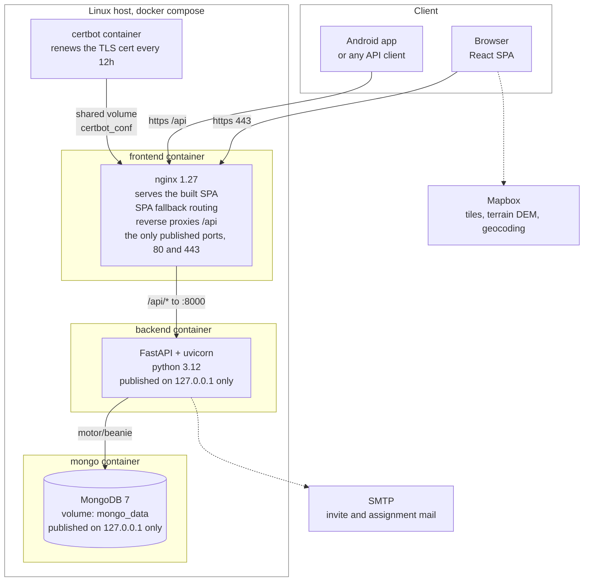
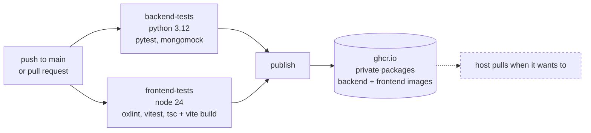

# Deployment and components

Four containers behind one domain. The browser only ever talks to nginx, which is
why there is no CORS in production and no API host baked into the frontend build
beyond the path `/api`.

## Why it is shaped this way

- **Same origin in production.** An earlier build baked `localhost:8000` into the
  bundle, which is the visitor's own machine, not the server. nginx proxying
  `/api` fixes that at the deployment layer instead of with runtime config, and
  CORS is then only needed for local dev where vite runs on :5173.
- **Vite bakes its env at build time**, so `VITE_API_URL` is a docker build arg,
  not container env. The Mapbox token deliberately is not: it is served by the API
  at runtime to signed in users, which keeps it out of a bundle anyone can fetch
  and means rotating it does not need a frontend rebuild. CI therefore needs no
  Mapbox secret at all.
- **The cert lives in a named volume** (`certbot_conf`) and is a real, rate
  limited Let's Encrypt cert, so the stack is brought down with `docker compose
  down`, never `down -v`.
- **Only nginx is reachable from outside.** Mongo and the backend publish to
  `127.0.0.1` rather than every interface. A bare `ports:` entry in compose binds
  `0.0.0.0`, which on a public host meant the database answered the internet with
  no authentication configured, and the API answered without the TLS in front of
  it. Both still work from the host itself, so mongosh and local debugging are
  unaffected. Adding Mongo credentials is the next layer and is not done yet.
- **Mongo's healthcheck gates the backend.** The backend container waits for a
  passing ping before it starts, up to five minutes, so a cold boot on a slow
  host does not race.

## CI

The publish job is packaging only, it does not deploy. Images are tagged `latest`
on the default branch plus the full commit sha, and pull requests run the tests
without publishing anything. The backend suite needs no mongo service because it
runs against `mongomock-motor`.

**Node 24, not 20.** The test stack (vitest 5, jsdom 30, undici 8) requires 22 or
newer, and on 20 undici threw `webidl.util.markAsUncloneable is not a function`
while jsdom was loading, so every worker died before a single test ran. The
`EBADENGINE` warnings in the install log said so plainly. The floor is stated once
in `package.json` engines, and the frontend image builds on `node:24-alpine` so CI,
the image and the dev machine all agree. Every action is pinned to a major that
runs on Node 24, since GitHub is retiring the Node 20 action runtime.
