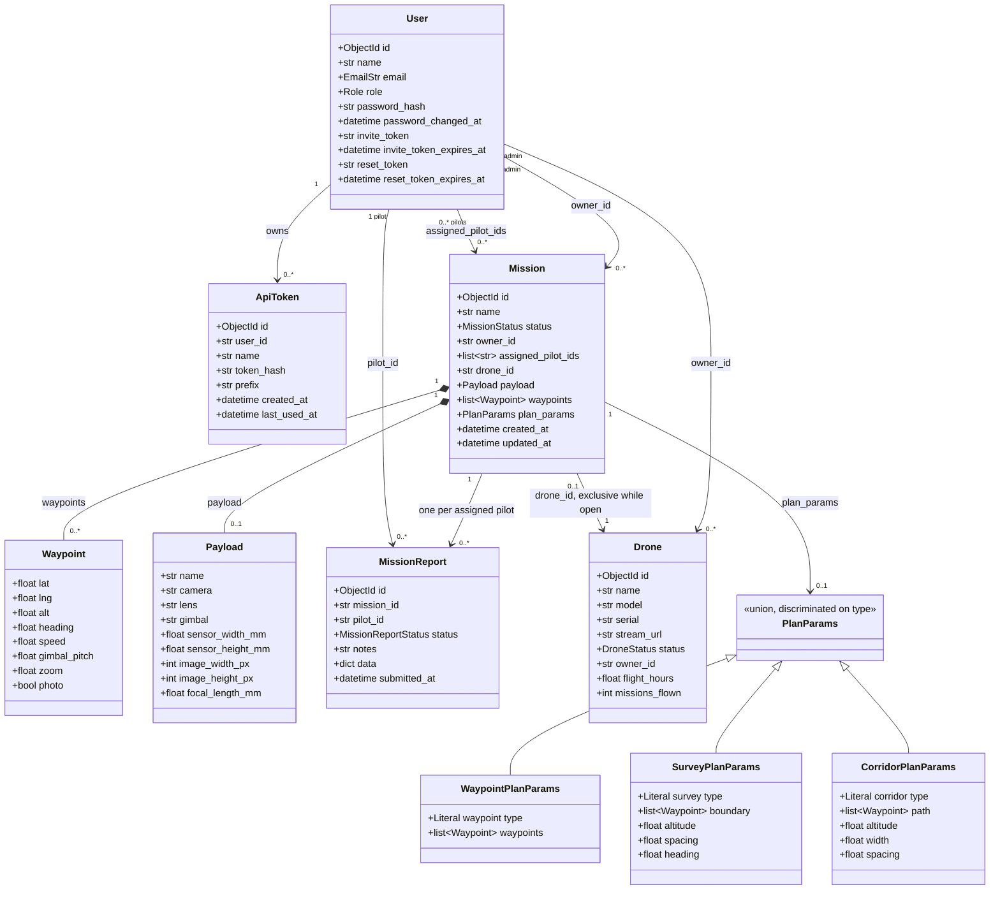

# Domain model

The five documents stored in Mongo, and how they reference each other.

Nothing is embedded across resources: references are string ids, so a mission can
be read without dragging its pilots or its aircraft along with it. Two values are
embedded, `Waypoint` and `Payload`, and the reason differs for each. See the note
on snapshots below, it is the more interesting of the two.

`PlanParams` is a discriminated union rather than a class hierarchy. Pydantic and
TypeScript both narrow on the `type` field natively, so adding a plan type means
adding a member, not touching the route handlers.

## Notes worth saying out loud

- **The payload is copied onto the mission; the aircraft is referenced.** Both are
  "what flew this", and they are modelled oppositely on purpose. The payload
  catalogue is static reference data nobody owns, so a mission stores its own copy
  of the sensor figures and still reads correctly years later if the catalogue
  changes. A drone is an owned record with a lifecycle and accumulating state
  (hours, mission count), so copying it would create a second source of truth that
  drifts. I considered snapshotting the aircraft the same way when working out what
  deleting one should mean, and turned it down for exactly that reason.
- **A booking is exclusive.** One aircraft, one open mission. `bookings.holder_of`
  is the single answer to "who holds this drone", and every mission that is not
  `completed` counts as holding it. Publishing requires a booked aircraft; saving
  never does, so a half-finished draft is always allowed.
- **`waypoints` is stored alongside `plan_params`, not derived from it on read.**
  `plan_params` is the recipe (boundary, spacing, altitude), `waypoints` is the
  baked route. Keeping both means the settings stay editable later without
  re-deriving, and the Android client never has to know how a sweep is generated,
  it just flies the points.
- **A waypoint carries what the payload should do there.** `gimbal_pitch`, `zoom`
  and `photo` are all optional, so old plans load unchanged, and they are what the
  `.waypoints` export turns into MAVLink DO commands.
- **The wire shape is not the document shape.** `MissionSummaryOut` (the list) drops
  `waypoints`, `plan_params` and `payload` and carries a `waypoint_count` instead;
  `MissionOut` (one mission) extends it with all three. Note that for a manually
  placed plan `plan_params.waypoints` is a second copy of the whole route, so
  leaving it off the list matters as much as the waypoints themselves.
- **One report per (mission, pilot) pair**, enforced by a unique compound index and
  checked before the insert so a second attempt reads as a 409 rather than a failed
  write. Multiple pilots on one mission each report independently.
- **`MissionReport.data` is a free-form dict** on purpose. What comes back off a
  flight is not a fixed schema, and pinning one now would be a guess. The two keys
  the app reads today (`duration_minutes`, `photos`) are read defensively.
- **`ApiToken` stores only a SHA-256 hash.** Not bcrypt: these are 32 bytes of
  generated entropy, not user-chosen passwords, so there is nothing to slow a
  dictionary attack against, and the hash is checked on every request.
- **`User.password_changed_at` is what makes a reset mean something.** Every JWT
  carries the value it was minted against, and a token older than the account's
  current one is refused, so resetting a password logs out whoever had the old one.
