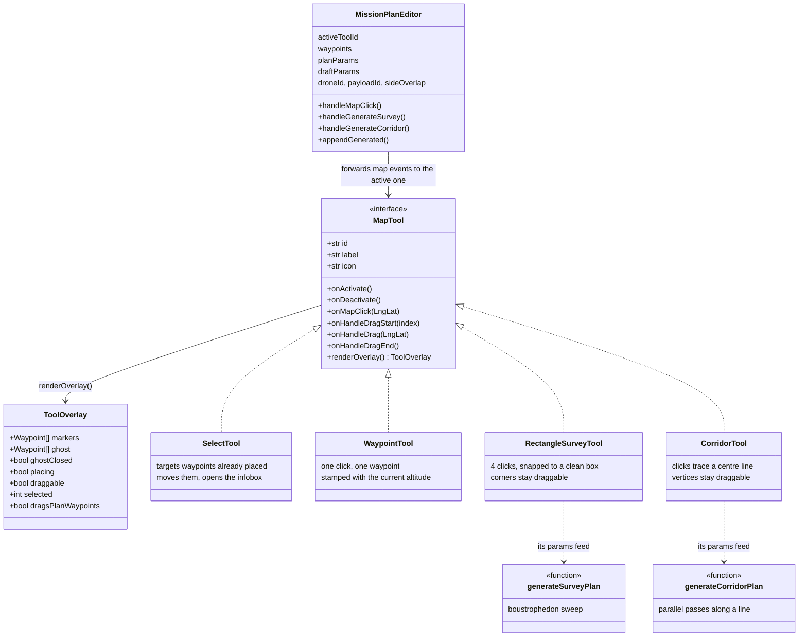
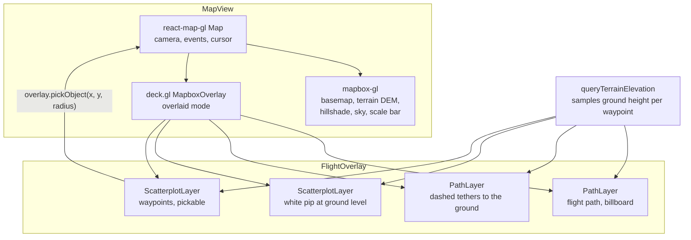

# Map tools and the rendering stack

## The tool registry

Everything the admin can do on the map is a `MapTool`. The editor holds a
registry and knows nothing about what any individual tool does, it just forwards
map events to whichever one is active and draws whatever overlay it hands back.



Adding the corridor tool is the proof that this shape pays off. It took: one
`createCorridorTool`, one generator function, one union member on each side of
the wire, and a button. **No existing tool, route or handler changed.**

Three deliberate details:

- **Drawing and committing are separate steps.** A tool's `renderOverlay()` output
  is a draft, drawn differently from the real plan, so a half placed box never
  looks like a route. The sweep itself only runs when the admin clicks Generate.
- **Tools are built once and read settings through getters.** Changing the
  altitude mid-plan must not rebuild the tools and drop what is already placed, so
  the editor passes `getSettings`/`getWaypoints` closures over refs rather than
  passing values.
- **A draft shape is not the plan.** `draftParams` is separate from `planParams`,
  which fixed two reported bugs at once: drawing a corridor used to wipe every
  waypoint already placed, and the Generate button used to survive a tool switch
  and offer to generate from a ghost that was no longer on screen. Generating
  appends to the plan rather than replacing it, and switching tools discards an
  ungenerated draft.

## The payload drives the route

The picker is not decoration. Choosing a payload swaps the "line spacing" input
for "side overlap", and the spacing the generators actually receive is computed:

```
gsd_cm_px    = altitude * sensor_width_mm * 100 / (focal_length_mm * image_width_px)
frame_width  = altitude * sensor_width_mm / focal_length_mm
line_spacing = frame_width * (1 - side_overlap / 100)
```

So the payload and the altitude change the flight path, not just a number on a
panel. Frame width is the widest the passes can be before strips of ground go
unphotographed; overlap pulls them closer so consecutive frames share features,
which is what photogrammetry needs to stitch. Spacing is floored at 1 m, because a
spacing of zero asks the generator for an endless number of lines.

The toolbar is glyphs rather than labels: the text wrapped to two lines and pushed
the panel below the viewport. The tooltip names the tool, a line under the toolbar
says what it does, and the cursor is a crosshair while a tool is still taking
points and returns to normal once it has what it needs.

## Rendering: why the flight plan is deck.gl and not mapbox layers



- **Mapbox line and circle layers are always pinned to the ground.** Altitude is
  the whole point of a flight plan, so the route is drawn in deck.gl where z is
  real.
- **deck.gl's z is metres above sea level, drone altitude is above ground.** So
  the terrain is sampled per waypoint and the ground height is added underneath.
  Without that, a plan over a hill renders inside the hill.
- **Hit testing goes through deck, not mapbox.** `overlay.pickObject` with a
  generous radius, so the click target matches the dot you can see at altitude
  rather than the spot on the ground beneath it.
- **The infobox is a hand positioned div**, not a mapbox Popup, because a Popup
  can only anchor to a ground coordinate. Its screen point comes from
  `WebMercatorViewport.project()`.
