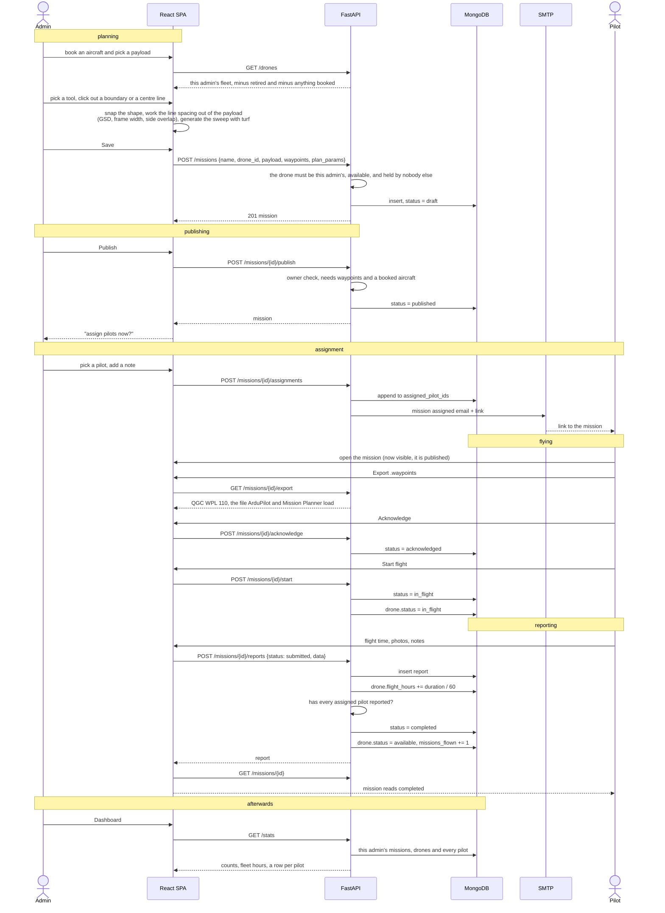

# End to end flow

One mission, from an empty map to a completed record with flight hours on the
aircraft. This is the demo path.



## The authorization check that runs on nearly every step

Every mission route goes through one helper rather than repeating the rule:

```python
owns = (mission.owner_id == current_user.user_id
        if current_user.role == Role.ADMIN
        else current_user.user_id in mission.assigned_pilot_ids)
if not owns:
    raise HTTPException(status_code=404)
```

Two things to point out:

1. **Admins are isolated from each other.** Admin A cannot see or touch admin B's
   missions, while the pilot pool stays shared. This was a real gap I found and
   closed: the list route was a `find_all()` and the ownership check never ran for
   admins.
2. **Not-yours reads as 404, not 403.** A 403 would confirm the resource exists to
   anyone walking ids. Role refusals (a pilot trying to publish) stay 403, because
   there the existence of the thing was never the secret.
