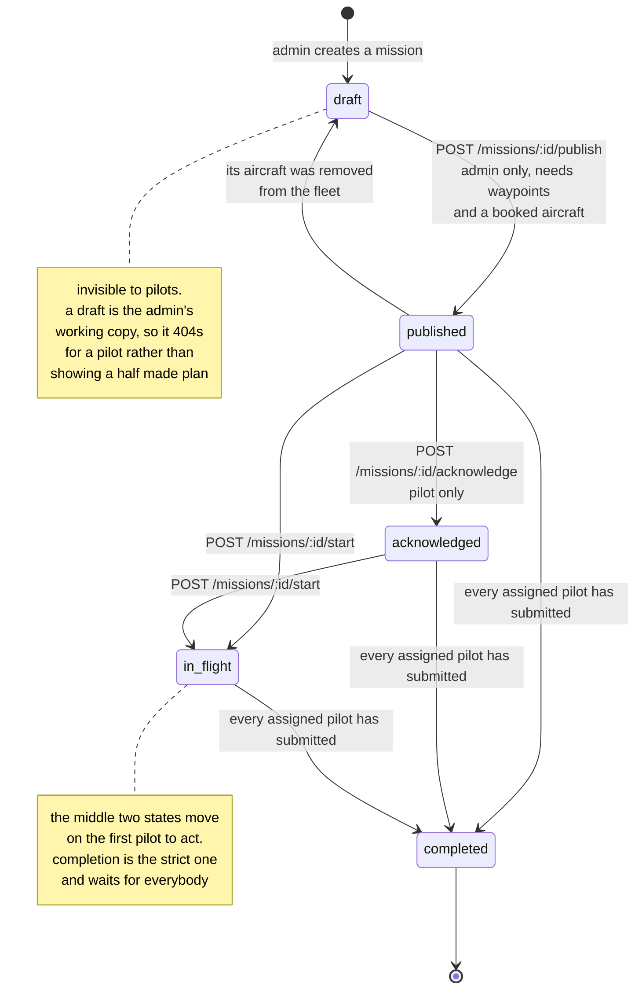
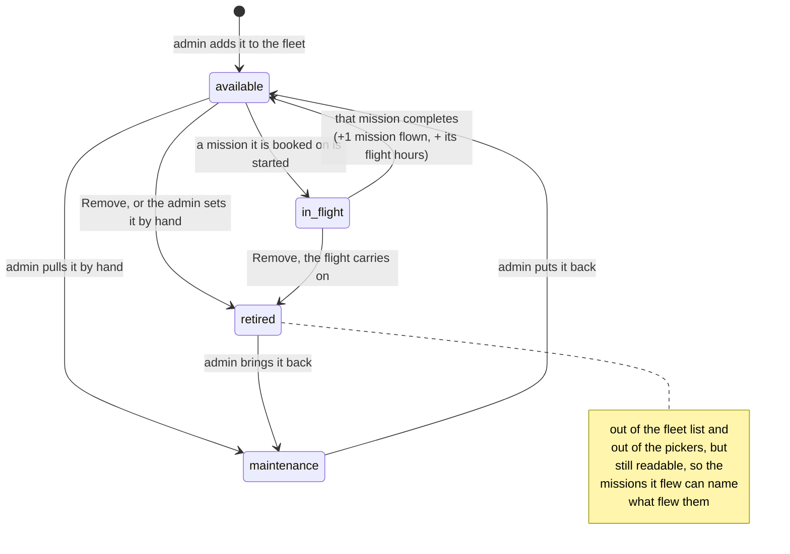

# Mission lifecycle

Status is never set by the client. There is no field for it on create or update,
only routes that move it, and each route checks the state it is moving from.



## Who may move it

| Transition | Who | Refused with |
|---|---|---|
| draft to published | the owning admin | 403 for a pilot, 409 if already published, 409 with no waypoints or no aircraft |
| published to acknowledged | an assigned pilot | 403 for an admin, 409 from any other state |
| published/acknowledged to in_flight | an assigned pilot | 403 for an admin, 409 from draft or completed |
| published back to draft | nobody directly, it follows from removing the aircraft | n/a |
| anything open to completed | nobody directly, it is a consequence | n/a |

Completion has no route of its own. It happens when the last outstanding report
is submitted, checked inside the report handler:

```python
reported = {r.pilot_id for r in submitted_reports}
if not set(mission.assigned_pilot_ids).issubset(reported):
    return
mission.status = MissionStatus.COMPLETED
```

That is the reason a pilot cannot mark a mission done by hand. Finishing is
defined as everyone having reported, so the state follows the evidence.

**The published-to-draft edge is the newer one.** Publishing requires a booked
aircraft, so a published mission whose aircraft leaves the fleet would otherwise
sit there unflyable. Removing a drone hands it back from every draft and published
mission that held it, and a published one drops to draft. Its assigned pilots get
an email saying so, because the mission vanishes from their queue the moment it
stops being published.

Hours are banked once, as a report is handed in, not every time it is saved. An
already-submitted report being edited does not add its flight to the aircraft a
second time.

## The drone's own state follows the mission



**Available and in_flight are the system's to set; maintenance and retired are the
admin's.** `set_drone_status` moves the first pair as missions start and complete,
and it refuses to touch a retired aircraft, so an admin's decision is never undone
by mission traffic.

**Retiring is how an aircraft leaves the fleet, and it is the only mechanism.**
The Remove button and the status dropdown do the same thing, which is why there is
no second "deleted" flag. A drone that has never flown is actually deleted, since
there is no history to keep. One that has flown is retired: dropped from the fleet
list, dropped from the aircraft pickers, still resolvable by id, and recoverable by
setting a status on it again. A **Show retired** toggle on the fleet page asks for
them back.

An aircraft that is out on a live mission can be removed too. Deleting a row does
not land an aircraft: the flight keeps its drone and its status, the pilot's report
still logs hours and the mission count against it, and because retired is sticky it
never returns to `available` when the flight ends.
